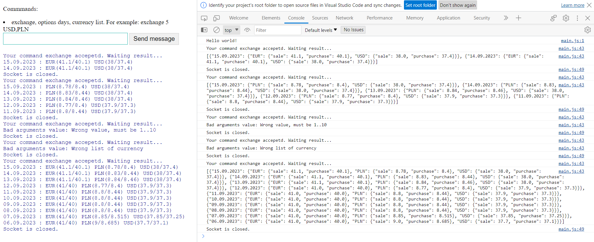
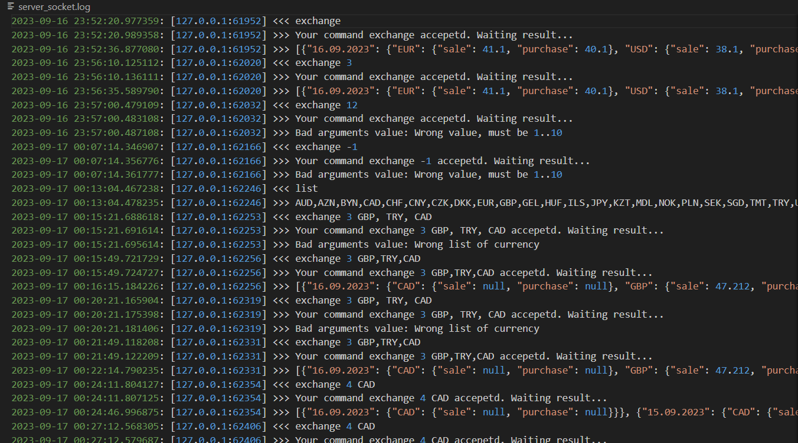
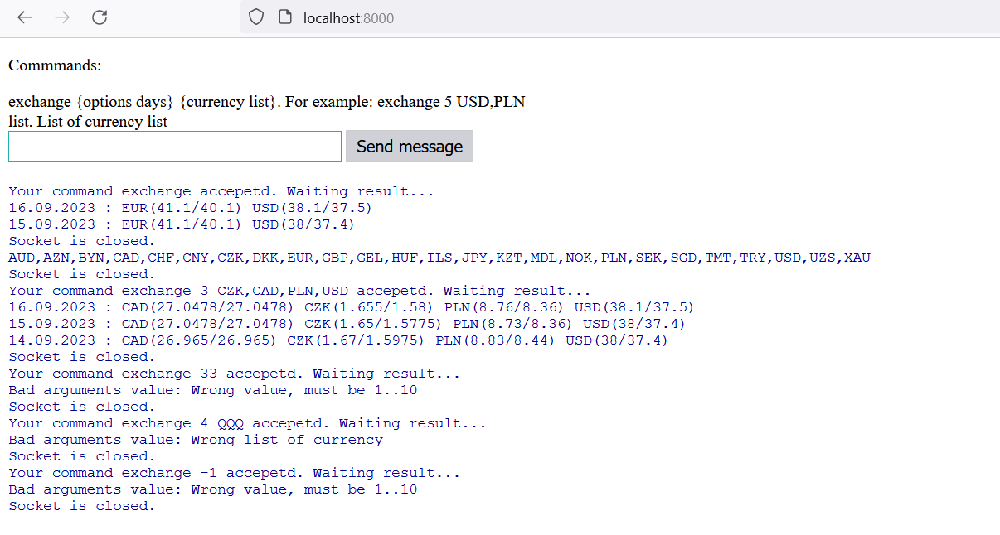

# goit_python_web_hw_05

Домашнє завадння 05.

1. Консольний застосунок / Модуль запиту курсу валют - hw_05/exchange.py
2. Консольний застосунок / WebSocket Server - hw_05/server_websoket.py
3. Консольний застосунок / WebSocket Client - hw_05/client_websoket.py
4. Консольний застосунок / Web Server aiohttp - hw_05/server_http_async.py
5. Консольний застосунок / Web Server HTTPServer - hw_05/server_http_sync.py
6. HTML WebSocket Client на JavaScript - html/index.html
7. WebSocket Server зберігає протоколи запитів до файлу  logs/server_socket.log
7. Docker. 
    - Збирання образу: scripts/docker_build_image.cmd 
    - Всі серевери заускаються у одному контейнері: scripts/docker_run.cmd 
    - Доступ за http://localhost:8000, сокет сервер: ws://localhost:8000
    - Образ є тут: https://hub.docker.com/r/lexxai/web_hw_05


https://github.com/lexxai/goit_python_web_hw_05
https://hub.docker.com/r/lexxai/web_hw_05


```
usage: exchange.py.py [-h] [--days DAYS] [--currencies CURRENCIES] [--verbose]

Get exchangeRate from Bank: AUD,AZN,BYN,CAD,CHF,CNY,CZK,DKK,EUR,GBP,GEL,HUF,ILS,JPY,KZT,MDL,NOK,PLN,SEK,SGD,TMT,TRY,USD,UZS,XAU   

options:
  -h, --help            show this help message and exit
  --days DAYS           How many datys need to show reqults, max. 10 days, default: 2
  --currencies CURRENCIES
                        currencies for list. Allowed: items
                        "AUD,AZN,BYN,CAD,CHF,CNY,CZK,DKK,EUR,GBP,GEL,HUF,ILS,JPY,KZT,MDL,NOK,PLN,SEK,SGD,TMT,TRY,USD,UZS,XAU".    
                        Please use coma separeted list. default: EUR,USD
  --verbose             print deailed log
```


## default run
```
python main.py                            
[
  {
    "14.09.2023": {
      "EUR": {
        "sale": 41.1,
        "purchase": 40.1
      },
      "USD": {
        "sale": 38.0,
        "purchase": 37.4
      }
    }
  },
  {
    "13.09.2023": {
      "EUR": {
        "sale": 41.1,
        "purchase": 40.1
      },
      "USD": {
        "sale": 38.0,
        "purchase": 37.4
      }
    }
  }
]

```


## currencies
```
python main.py   --currencies EUR,USD,GBP                 
[
  {
    "14.09.2023": {
      "EUR": {
        "sale": 41.1,
        "purchase": 40.1
      },
      "GBP": {
        "sale": 47.46,
        "purchase": 45.4
      },
      "USD": {
        "sale": 38.0,
        "purchase": 37.4
      }
    }
  },
  {
    "13.09.2023": {
      "EUR": {
        "sale": 41.1,
        "purchase": 40.1
      },
      "GBP": {
        "sale": 47.46,
        "purchase": 45.4
      },
      "USD": {
        "sale": 38.0,
        "purchase": 37.4
      }
    }
  }
]
```
## days 
```
python main.py   --currencies EUR,USD,GBP --days 4 
[
  {
    "14.09.2023": {
      "EUR": {
        "sale": 41.1,
        "purchase": 40.1
      },
      "GBP": {
        "sale": 47.46,
        "purchase": 45.4
      },
      "USD": {
        "sale": 38.0,
        "purchase": 37.4
      }
    }
  },
  {
    "13.09.2023": {
      "EUR": {
        "sale": 41.1,
        "purchase": 40.1
      },
      "GBP": {
        "sale": 47.46,
        "purchase": 45.4
      },
      "USD": {
        "sale": 38.0,
        "purchase": 37.4
      }
    }
  },
  {
    "12.09.2023": {
      "EUR": {
        "sale": 41.0,
        "purchase": 40.0
      },
      "GBP": {
        "sale": 47.39,
        "purchase": 45.45
      },
      "USD": {
        "sale": 37.9,
        "purchase": 37.3
      }
    }
  },
  {
    "11.09.2023": {
      "EUR": {
        "sale": 41.0,
        "purchase": 40.0
      },
      "GBP": {
        "sale": 47.45,
        "purchase": 45.51
      },
      "USD": {
        "sale": 37.9,
        "purchase": 37.3
      }
    }
  }
]
```
## verbose
```
python main.py   --currencies PLN --days 2 --verbose         
2023-09-15 04:04:26,151  Get request for 2 days
2023-09-15 04:04:26,151  Get request for: 14.09.2023
2023-09-15 04:04:26,151  Get request for: 13.09.2023
2023-09-15 04:04:26,151  Waing result for 2 requests
[
  {
    "14.09.2023": {
      "PLN": {
        "sale": 8.84,
        "purchase": 8.46
      }
    }
  },
  {
    "13.09.2023": {
      "PLN": {
        "sale": 8.84,
        "purchase": 8.46
      }
    }
  }
]


```

## Progress bas + verbose
WARNING: retured data unsorted in this case
```
python main.py   --currencies PLN --days 10 --verbose 
2023-09-15 04:16:35,705  Get request for 10 days
2023-09-15 04:16:35,705  Get request for: 14.09.2023
2023-09-15 04:16:35,705  Get request for: 13.09.2023
2023-09-15 04:16:35,705  Get request for: 12.09.2023
2023-09-15 04:16:35,705  Get request for: 11.09.2023
2023-09-15 04:16:35,705  Get request for: 10.09.2023
2023-09-15 04:16:35,705  Get request for: 09.09.2023
2023-09-15 04:16:35,705  Get request for: 08.09.2023
2023-09-15 04:16:35,705  Get request for: 07.09.2023
2023-09-15 04:16:35,705  Get request for: 06.09.2023
2023-09-15 04:16:35,705  Get request for: 05.09.2023
2023-09-15 04:16:35,705  Waing result for 10 requests
 30%|███████████████████████████▉                                                                 | 3/10 [00:10<00:26,  3.83s/it]
```

## errors response code
```
--currencies PLN --days 10 --verbose
2023-09-15 04:36:49,495  Get request for 10 days
2023-09-15 04:36:49,495  Get request for: 14.09.2023
2023-09-15 04:36:49,495  Get request for: 13.09.2023
2023-09-15 04:36:49,495  Get request for: 12.09.2023
2023-09-15 04:36:49,495  Get request for: 11.09.2023
2023-09-15 04:36:49,495  Get request for: 10.09.2023
2023-09-15 04:36:49,495  Get request for: 09.09.2023
2023-09-15 04:36:49,495  Get request for: 08.09.2023
2023-09-15 04:36:49,495  Get request for: 07.09.2023
2023-09-15 04:36:49,495  Get request for: 06.09.2023
2023-09-15 04:36:49,495  Get request for: 05.09.2023
2023-09-15 04:36:49,495  Waing result for 10 requests
2023-09-15 04:36:50,060  https://api.privatbank.ua/p24api/exchange_rates?json&date=13.09.2023, response code:429
2023-09-15 04:36:50,060  https://api.privatbank.ua/p24api/exchange_rates?json&date=06.09.2023, response code:429
 60%|███████████████████████████████████████████████████████▊                                     | 6/10 [00:25<00:16,  4.03s/it] 

```

## errror URL or DNS

```
python main.py   --currencies PLN --days 10 --verbose
2023-09-15 04:47:19,895  Get request for 10 days
2023-09-15 04:47:19,895  Get request for: 14.09.2023
2023-09-15 04:47:19,895  Get request for: 13.09.2023
2023-09-15 04:47:19,895  Get request for: 12.09.2023
2023-09-15 04:47:19,895  Get request for: 11.09.2023
2023-09-15 04:47:19,895  Get request for: 10.09.2023
2023-09-15 04:47:19,895  Get request for: 09.09.2023
2023-09-15 04:47:19,895  Get request for: 08.09.2023
2023-09-15 04:47:19,895  Get request for: 07.09.2023
2023-09-15 04:47:19,895  Get request for: 06.09.2023
2023-09-15 04:47:19,895  Get request for: 05.09.2023
2023-09-15 04:47:19,895  Waing result for 10 requests
2023-09-15 04:47:31,111  Error open https://api.priva#tbank.ua/p24api/exchange_rates?json&date=14.09.2023: Cannot connect to host api.priva:443 ssl:default [getaddrinfo failed]
2023-09-15 04:47:31,125  Error open https://api.priva#tbank.ua/p24api/exchange_rates?json&date=12.09.2023: Cannot connect to host api.priva:443 ssl:default [getaddrinfo failed]
2023-09-15 04:47:31,125  Error open https://api.priva#tbank.ua/p24api/exchange_rates?json&date=09.09.2023: Cannot connect to host api.priva:443 ssl:default [getaddrinfo failed]
2023-09-15 04:47:31,144  Error open https://api.priva#tbank.ua/p24api/exchange_rates?json&date=11.09.2023: Cannot connect to host api.priva:443 ssl:default [getaddrinfo failed]
2023-09-15 04:47:31,149  Error open https://api.priva#tbank.ua/p24api/exchange_rates?json&date=08.09.2023: Cannot connect to host api.priva:443 ssl:default [getaddrinfo failed]
2023-09-15 04:47:31,152  Error open https://api.priva#tbank.ua/p24api/exchange_rates?json&date=07.09.2023: Cannot connect to host api.priva:443 ssl:default [getaddrinfo failed]
2023-09-15 04:47:31,157  Error open https://api.priva#tbank.ua/p24api/exchange_rates?json&date=05.09.2023: Cannot connect to host api.priva:443 ssl:default [getaddrinfo failed]
2023-09-15 04:47:31,160  Error open https://api.priva#tbank.ua/p24api/exchange_rates?json&date=13.09.2023: Cannot connect to host api.priva:443 ssl:default [getaddrinfo failed]
2023-09-15 04:47:31,163  Error open https://api.priva#tbank.ua/p24api/exchange_rates?json&date=06.09.2023: Cannot connect to host api.priva:443 ssl:default [getaddrinfo failed]
2023-09-15 04:47:31,165  Error open https://api.priva#tbank.ua/p24api/exchange_rates?json&date=10.09.2023: Cannot connect to host api.priva:443 ssl:default [getaddrinfo failed]
100%|████████████████████████████████████████████████████████████████████████████████████████████| 10/10 [00:11<00:00,  1.13s/it] 
2023-09-15 04:47:31,183  Some days was skipped, retuned only  0 records from 10
[]

```


## error response code
```
python main.py   --currencies PLN --days 10 --verbose
2023-09-15 04:51:43,918  Get request for 10 days
2023-09-15 04:51:43,918  Get request for: 14.09.2023
2023-09-15 04:51:43,934  Get request for: 13.09.2023
2023-09-15 04:51:43,934  Get request for: 12.09.2023
2023-09-15 04:51:43,934  Get request for: 11.09.2023
2023-09-15 04:51:43,934  Get request for: 10.09.2023
2023-09-15 04:51:43,934  Get request for: 09.09.2023
2023-09-15 04:51:43,934  Get request for: 08.09.2023
2023-09-15 04:51:43,934  Get request for: 07.09.2023
2023-09-15 04:51:43,934  Get request for: 06.09.2023
2023-09-15 04:51:43,934  Get request for: 05.09.2023
2023-09-15 04:51:43,934  Waing result for 10 requests
2023-09-15 04:51:44,577  https://api.privatbank.ua/p24api/exchange_rates?json&date=13.09.2023, response code:429
100%|████████████████████████████████████████████████████████████████████████████████████████████| 10/10 [00:50<00:00,  5.06s/it] 
2023-09-15 04:52:34,535  Some days was skipped, retuned only 9 records from 10
[
  {
    "09.09.2023": {
      "PLN": {
        "sale": 8.8,
        "purchase": 8.44
      }
    }
  },
  {
    "07.09.2023": {
      "PLN": {
        "sale": 8.85,
        "purchase": 8.515
      }
    }
  },
  {
    "14.09.2023": {
      "PLN": {
        "sale": 8.84,
        "purchase": 8.46
      }
    }
  },
  {
    "06.09.2023": {
      "PLN": {
        "sale": 9.0,
        "purchase": 8.685
      }
    }
  },
  {
    "05.09.2023": {
      "PLN": {
        "sale": 9.04,
        "purchase": 8.73
      }
    }
  },
  {
    "12.09.2023": {
      "PLN": {
        "sale": 8.77,
        "purchase": 8.4
      }
    }
  },
  {
    "10.09.2023": {
      "PLN": {
        "sale": 8.8,
        "purchase": 8.44
      }
    }
  },
  {
    "11.09.2023": {
      "PLN": {
        "sale": 8.8,
        "purchase": 8.44
      }
    }
  },
  {
    "08.09.2023": {
      "PLN": {
        "sale": 8.8,
        "purchase": 8.44
      }
    }
  }
]
```

# SERVER/CLIENT

## Client


```
client.py
What's your command (exchange, exit)?
exchange
>>> exchange
<<< Your command exchange accepetd. Result of command:
[
  {
    "14.09.2023": {
      "EUR": {
        "sale": 41.1,
        "purchase": 40.1
      },
      "USD": {
        "sale": 38.0,
        "purchase": 37.4
      }
    }
  },
  {
    "13.09.2023": {
      "EUR": {
        "sale": 41.1,
        "purchase": 40.1
      },
      "USD": {
        "sale": 38.0,
        "purchase": 37.4
      }
    }
  }
]
```


```
client.py
What's your command (exchange, exit)?
exchange 1 USD,PLN
>>> exchange 1 USD,PLN
<<< Your command exchange accepetd. Result of command:
[
  {
    "14.09.2023": {
      "PLN": {
        "sale": 8.83,
        "purchase": 8.44
      },
      "USD": {
        "sale": 38.0,
        "purchase": 37.4
      }
    }
  }
]
```

## RESULT WEB CHAT



## RESULT WEBSOCKET SERVER LOG



## RESULT LOCAL WEB SERVER 



